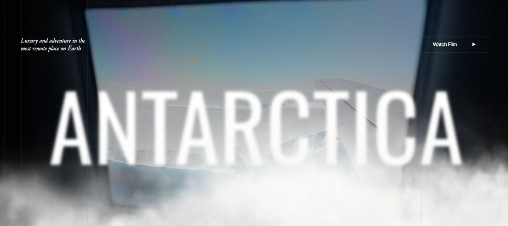
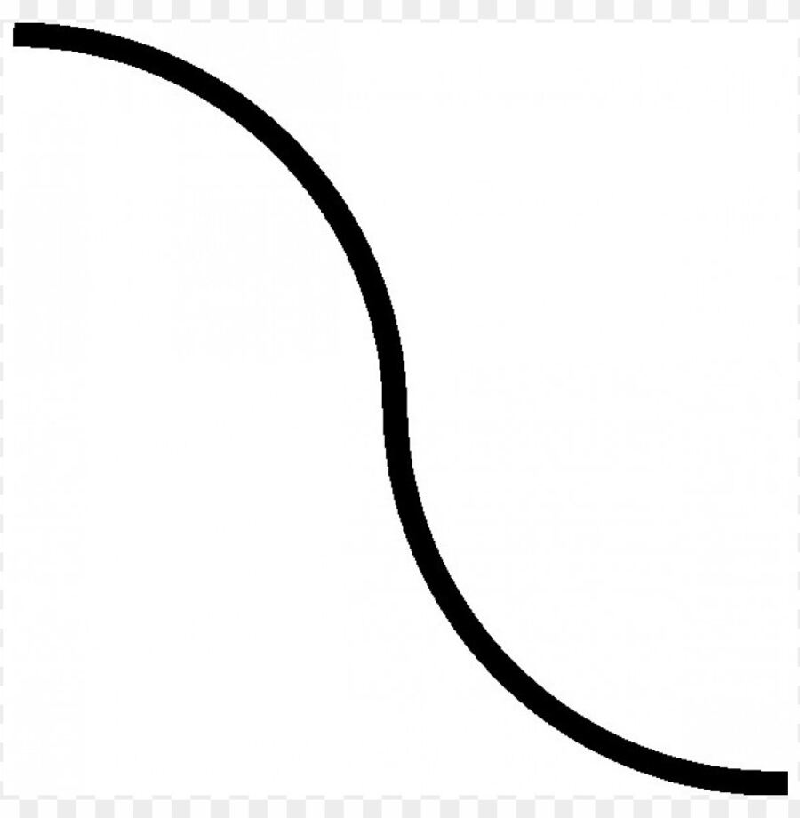
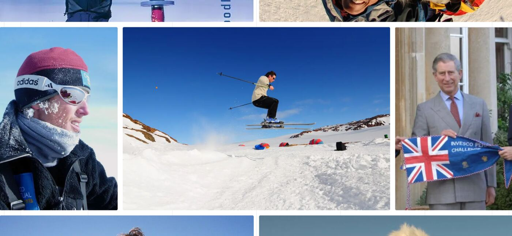
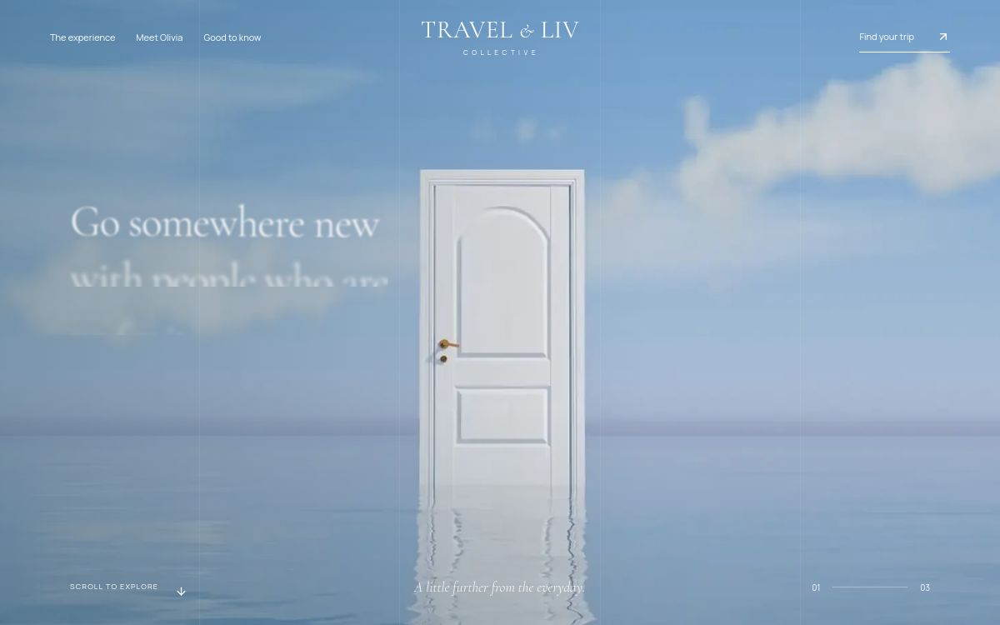

# Homepage motion and layout review

This note records the requested fixes from the latest review, the reason for each change, and a concrete prompt that can be reused if the behavior drifts again. The reference screenshots below are the client-provided visual references; they are not screenshots of the Travel & LIV page.

## 1. Door scene moves too quickly

**What was wrong:** The door video playhead advanced across a relatively short page section, and the same page also had wheel smoothing. That made it difficult to control the door opening with a normal scroll.

**Change made:** Extend the hero scroll range to 470 small viewport heights on desktop and 420 on mobile. Let native browser scrolling drive ScrollTrigger, with a light scrub to settle the video playhead. This avoids stacking Lenis wheel smoothing on top of ScrollTrigger scrubbing. Text transitions retain their stagger but stay tied to the longer scene.

**Fix prompt:** “Slow the existing door-opening scene by giving its scroll sequence more room. Keep the door video synchronized to the visitor’s scroll, preserve the approved headline, intro and trip CTA, and avoid adding a second scroll-smoothing system. Keep touch scrolling native and check reduced-motion behavior.”

## 2. Experience photos sweep too far

**What was wrong:** Photo entry and exit distances were larger than the visible composition, and each chapter had a short hold. The images could feel like they were flying through the page instead of arriving into a scene.

**Change made:** Extend the chapter sequence, reduce entry and exit travel to about two-thirds of the viewport, soften rotation, and lengthen the photo stagger. During each chapter the photos drift only a small distance. On mobile the image row still moves enough to reveal the next cards.

**Fix prompt:** “Keep the three experience chapters as one continuous scroll scene. Have each new image group enter from the left with a restrained travel distance, gentle rotation and stagger. Give the copy and photos time to be read before the next chapter; keep mobile image movement inside the viewport and do not add motion to unrelated sections.”

## 3. Scroll reveals should support the story

**What was wrong:** Reveal timing and photo movement competed with the main story beats in places. Motion should make the sequence easier to follow rather than add effects to every element.

**Change made:** Keep the existing heading and paragraph reveals, founder image mask, photo parallax, collage unfold and chapter transitions. Use native scroll plus GSAP ScrollTrigger as the single motion driver. No extra animation framework or custom scroll loop was added.

**Fix prompt:** “Review the existing page for a few useful scroll reveals: headings and short copy can rise and clear gently, photos can reveal with a small mask or parallax, and the collage can unfold in sequence. Keep one clear motion per moment, avoid animating every element, and preserve keyboard access, touch scrolling and reduced-motion behavior.”

## 4. Booking path beneath the FAQ did not match the brief

**What was wrong:** The original line did not read as a branch joining steps 01–03, and the artwork could compete with the booking instructions. The mobile composition also needed a clear vertical route.

**Change made:** Draw a single continuous curved path on desktop, passing the three steps in order. Use a vertical curve beside stacked cards on mobile. Keep the path behind solid step backgrounds, reduce the existing leaf/flower icons, and reveal them progressively with the same scroll progress as the path. Reduced-motion mode shows the path and icons fully without animation.

**Fix prompt:** “Redesign only the decorative path in the three-step booking section. Make it one continuous, delicate botanical branch connecting steps 01, 02 and 03. Attach small stems, leaves and flowers naturally along both sides; remove detached oversized symbols. As visitors scroll, extend the branch and let small buds open into flowers in a calm sequence. Keep every step readable and prevent artwork crossing text. On mobile, use a simple vertical branch beside stacked steps, with less motion and tighter spacing. Retain the muted green palette and elegant line weight.”

## Review limits

The project build and TypeScript checks pass. This runtime did not provide an interactive browser viewport for the current revision, so these changes have not been represented as after-state browser screenshots here. The supplied images in `reference/` show the intended visual direction only. Do not treat them as proof of the final render. Mobile CSS is implemented, but final physical-device QA remains outstanding. The group film was not opened or analyzed, following Olivia’s request to conserve video-inspection credits.

## Client visual references

These are the references attached in the brief, included here so the review stays with the code and repair prompts.

### Hero and overall scroll direction

### Curved path reference

### Photo reveal reference

### Published-page snapshot

This is a published-page thumbnail, not a motion study. It was captured while the headline reveal was still in progress, so it should not be used to judge the final resting state or animation smoothness. The current site can be opened directly at https://travel-and-liv-collective.cloutmedia-site.chatgpt.site.
